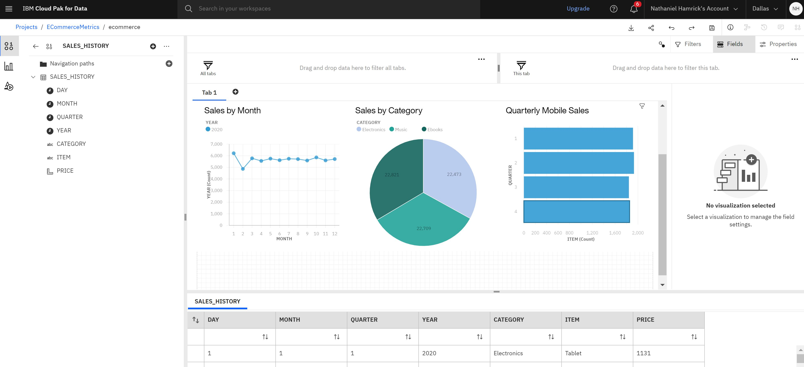
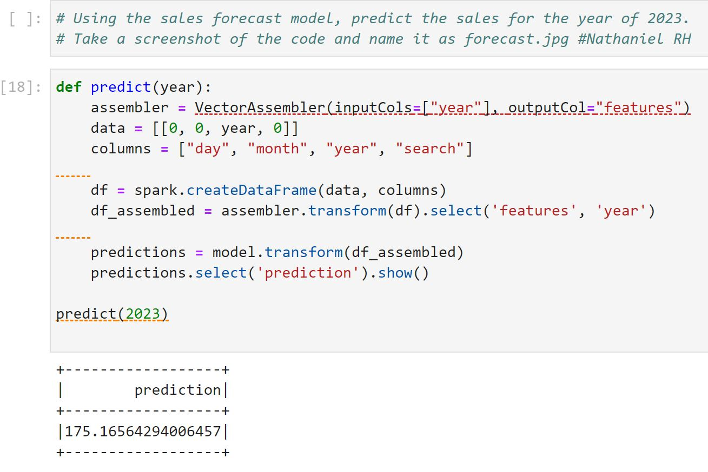

# IBM Data Engineering Capstone: E-commerce Data Platform and Analytics Pipeline Implementation

## TL;DR Summary

This project is a comprehensive implementation of an e-commerce data platform and analytics pipeline using various technologies and tools. The project consists of several hands-on labs, each representing a sub-project within the portfolio. 

## Summary

This project is a comprehensive implementation of an e-commerce data platform and analytics pipeline. The project showcases the use of various data engineering and data analysis technologies and tools, including SQL and NoSQL databases, data warehousing, ETL processes, workflow management, and machine learning. The project portfolio provides a structured and comprehensive overview of the work completed and the skills and tools utilized. Overall, this project represents an excellent demonstration of data engineering skills and would be a valuable addition to any data engineering or analytics portfolio.

## Overview

The project simulates the work of a data engineer at an e-commerce company. The company sells digital products like e-books, movies, and songs globally. The objective of the project is to design, implement and automate data pipelines that extract data from various sources, transform it, load it into a data warehouse, and analyze it to derive actionable insights.

## Labs

The project consists of several hands-on labs:

- **OLTP Database** Lab: Designing the schema for the OLTP database, loading data into the OLTP database, and automating admin tasks using MySQL.
- **NoSQL Database** Lab: Importing data into a MongoDB database, querying data in a MongoDB database, and exporting data from MongoDB.
- **Data Warehousing** Lab: Designing a data warehouse using the pgAdmin ERD design tool and loading data into the data warehouse. Writing aggregation queries and creating MQTs.
- **Dashboard Creation** Lab: Creating a dashboard using Cognos Analytics to reflect the key metrics of the business.
- **ETL** Lab: Writing a Python program that connects to IBM DB2 data warehouse and MySQL staging data warehouse, identifies the last row on IBM DB2, finds all rows later than the last row on the staging warehouse, and inserts the new data into IBM DB2 production data warehouse.
- **Data Pipelines using Apache Airflow** Lab: Authoring an Apache Airflow DAG that extracts data from a web server log file, transforms it, and loads the transformed data into a tar file.
- **SparkML Ops** Lab: Analyzing search terms data from the e-commerce web server, loading the sales forecast model, and predicting the sales for the year 2023.

## Skills and Tools

This project utilizes several skills and tools, including:

- Database design using **SQL** and **NoSQL** databases (**MySQL** and **MongoDB**)
- ETL processes
- Data warehousing using **pgAdmin** and **IBM DB2**
- **Query** optimization
- **Business intelligence** using **Cognos Analytics**
- **Python** programming
- **Apache Airflow** for workflow management
- **Machine learning** using **SparkML**

## Project Portfolio

The project portfolio is organized as follows:

- OLTP Database
  - Design the schema for the OLTP database.
  - Load data into the OLTP database.
  - Automate admin tasks.
- NoSQL Database
  - Import data into a MongoDB database.
  - Query data in a MongoDB database.
  - Export data from MongoDB.
- Data Warehousing
  - Design a data warehouse using the pgAdmin ERD design tool.
  - Load data into the data warehouse.
  - Write aggregation queries and create MQTs.
- Dashboard Creation
  - Create a dashboard using Cognos Analytics to reflect the key metrics of the business.
  ## This visual displays the work
  
- ETL
  - Write a Python program that connects to IBM DB2 data warehouse and MySQL staging data warehouse.
  - Identify the last row on IBM DB2.
  - Find all rows later than the last row on the staging warehouse.
  - Insert the new data into IBM DB2 production data warehouse.
- Data Pipelines using Apache Airflow
  - Author an Apache Airflow DAG that extracts data from a web server log file.
  - Transform the data.
  - Load the transformed data into a tar file.
- SparkML Ops
  - Analyze search terms data from the e-commerce web server.
  - Load the sales forecast model.
  - Predict the sales for the year 2023.
  ## This visual displays the model's forecast

The culmination of the work shows a linear regression model trained on a sample CSV file containing data on day, month, year, and search terms from only two months: November and December of 2021. The file had 10,000 rows, and using the trained model, I wrote code to predict sales for the year 2023.

After running the analysis, the model predicted 175 sales for the year 2023. Please note that this prediction is based on the limited data available in the CSV file and assumes no significant changes in consumer behavior or other external factors.
